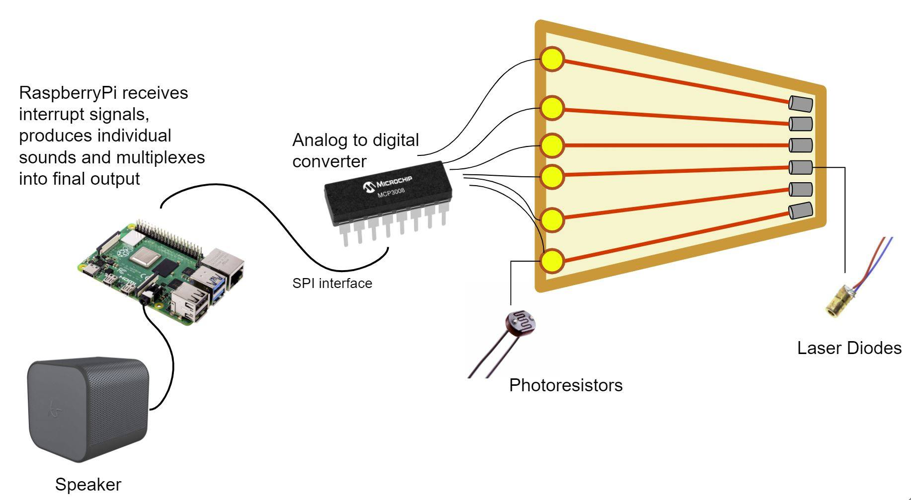

# Space Harp

</img>

## Project Description 

The purpose of this real time project is the construction of a simple electronic harp, where lasers will be used to simulate harp strings and pre-defined chords or notes corresponding to the appropriate strings will be played through the user audio output such as a monitor or USB speaker. 

The project will be undertaken in the C++ programming language and will use hardware such as a Raspberry Pi 4 . 

  <a href="https://github.com/adam7400/laser-harp">
	</img>
  </a>

Hardware: 

<li>Raspberry Pi 4 </li>
<li>Laser Diodes </li>
<li>Phototransistors </li>
<li>Analogue to Digital Converter (ADC) </li>
<li>Monitor(with audio output) or Speaker (Bluetooth or USB) </li>

## Table of Contents 

  <ol>
	<li> 
		<a href="## Project Description ">Project Description </a>   
	</li>
	<li>
		 <a href="## Project Aim and Objectives ">Project Aim and Objectives </a> 
	<li> 
		<a href="## Contributing to the project ">Contributing to the project </a>   
	</li>
	<li> 
		<a href="## Authors  ">Authors </a>   
	</li>
	<li> 
		<a href="## Contact Us">Contact Us </a>   
	</li>
	<li> 
		<a href="## License ">License </a>   
	</li>
  </ol>

## Project Aim and Objectives

### Project Aim
To develop an electronic harp that can play preselected notes or chords using a Raspberry Pi.

### Project Objectives

So that the development of the project is undertaken in an efficient manner the following objectives have been set out as good indicators to how the project should proceed. The objectives will be reviewed as the project progresses. 

<ol>
<li>Get 1 string working. </li>
<li>Get the remaining strings working. </li>
<li>Incorporate a way for the user to change notes or chords as they play. </li>
<li>Look at how to incorporate a Left-handed mode. </li>
<li>Develop efficient code in C++. </li>
<li>Document code throughout project. </li>
<li>Use version control throughout to track bugs, undertake revisions and test code. </li>
<li>Promote on GitHub, social media and through live demos. </li>
</ol>

## Contributing to the project

We are at the early stages of the project but if you wish to contribute, wish would be great !!! Please follow the following steps:

<ol>
<li>Fork the project repository</li>
<li>Clone or download the project repository </li>
<li>Create a new branch</li>
<li>Make suitable changes and commit them</li>
<li>Push the changes </li>
<li>Submit a pull request</li>
</ol>

If you are unsure about how to contribute, spot any problems or have suggestions on how we can improve, feel free to get in touch with us, our contact details can be found in the contact section. 

## Release of Versions 

<ul>
<li>Version 1.1 (v1.1) - Single String ,	Released 30/3/21 </li>
<li>Version 1.2 (v1.2) - Multiple Strings,	Release expected 12/4/21 </li>
</ul>

## Implementation

## Authors 

<ul>
<li> Alex Croke </li>
<li> Taniel Goetcherian </li>
<li> Adam Berdis </li>
</ul>

## Contact Us

<ul>
<li>Email -  spaceharp@outlook.com </li>
<li>Facebook -  </li>
<li>Instagram - </li>
<li>Youtube - </li>
<li>Twitter - </li>
</ul>

## License 

This project will operate under the terms of GNU General Public License v3.0 . Please refer to the LICENSE.md file in the repository for further information.
